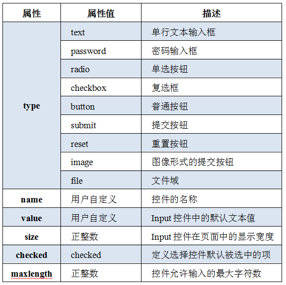

## 1、前言

（1） HTML是什么？

（2） 学习HTML可以做什么？

Web前端开发工程师、HTML5移动开发工程师、HTML5游戏开发工程师......

（3） HTML的发展历程

从初期的网络诞生后，已经出现了许多HTML版本：


（4） 学习内容

HTML   CSS

（5） 学习方法

纸质、有道云


## 2、认识网页

思考：网页是如何形成的？


## 3、常见浏览器

> 浏览器是网页运行的平台，常用的浏览器有IE、火狐（Firefox）、谷歌（Chrome）、Safari和Opera等。称为5大浏览器。


#### 3.1 浏览器市场占有份额（了解）

查看网站地址：http://tongji.baidu.com/data/browser


#### 3.2  浏览器内核（了解）

> 一个完整的浏览器包含**浏览器内核**和浏览器的外壳（shell）。浏览器内核又可以分为两部分：渲染引擎（Layout Engine或Rendering Engine）和JS引擎。由于JS引擎越来越独立，内核就倾向于只指渲染引擎。

**（1）浏览器组成结构**

浏览器一般由七个模块组成，User Interface（用户界面）、Browser engine（浏览器引擎）、Rendering engine（渲染引擎）、Networking（网络）、JavaScript Interpreter（js解释器）、UI Backend（UI 后端）、Date Persistence（数据持久化存储） 如下图： 


- 用户界面 －包括地址栏、后退/前进按钮、书签目录等，也就是你-所看到的除了页面显示窗口之外的其他部分

- 浏览器引擎 －可以在用户界面和渲染引擎之间传送指令或在客户端本地缓存中读写数据等，是浏览器中各个部分之间相互通信的核心

- 渲染引擎 －解析DOM文档和CSS规则并将内容排版到浏览器中显示有样式的界面，也有人称之为排版引擎，我们常说的浏览器内核主要指的就是渲染引擎

- 网络 －用来完成网络调用或资源下载的模块

- UI 后端 －用来绘制基本的浏览器窗口内控件，如输入框、按钮、单选按钮等，根据浏览器不同绘制的视觉效果也不同，但功能都是一样的。

- JS解释器 －用来解释执行JS脚本的模块，如 V8 引擎、JavaScriptCore

- 数据存储 －浏览器在硬盘中保存 cookie、localStorage等各种数据，可通过浏览器引擎提供的API进行调用

  ​

**（2）主流浏览器内核**

- **Trident(IE内核)**

  国内很多的双核浏览器其中之一就是Trident，美名其曰“兼容模式”。

  代表：IE、傲游、世界之窗浏览器、Avant、猎豹安全浏览器、360极速浏览器、百度浏览器等。

  Window10发布后，IE将其内置浏览器命名为Edge（原名斯巴达），使用了新内核Edge引擎。

- **Gecko（Firefox）**

  Gecko的特点是代码完全公开，因此，全世界的程序员都可以为其编写代码，增加功能。可惜这几年已经没落了，比如打开速度慢、升级频繁、猪一样的队友flash、神一样的对手Chrome。

- **Webkit（Safari）**

  苹果公司自己的内核，也是苹果的Safari浏览器使用的内核。是开源的。Google的Chrome也曾使用webkit作为内核。


- **Presto（Opera）**

  Presto是有Opera Software开发的浏览器排版引擎，它是世界公认最快渲染速度的引擎。在13年之后，Opera宣布加入谷歌阵营，弃用了Presto。


- **Blink（Chrome）**

  有Google和Opera Software开发的浏览器排版引擎，2013年4月发布，现在Chrome内核是Blink。Blink其实是webkit的分支，大部分国产浏览器最新版都采用Blink内核。


> 了解一下：
>
> 移动端的浏览器内核主要说的是系统内置浏览器的内核。
>
> 目前移动设备浏览器上常用的内核有Webkit、Blink、Trident、Gecko，其中苹果iOS平台主要是Webkit，Android4.4之前Android系统浏览器的内核是Webkit，Android4.4之后使用Blink，Windows Phone 8系统浏览器内核是Trident。


#### 3.3 IE低版本浏览器兼容HTML5

最新版的Safari、Chrome、Firefox以及Opera都支持HTML5，Internet Explorer 9将支持HTML5的特性。IE9以下版本浏览器兼容不HTML5，需要使用静态资源的html5shiv包：

```html
<!--[if lt IE 9]>
    <script src="http://cdn.static.runoob.com/libs/html5shiv/3.7/html5shiv.min.js"></script>
<![endif]-->
```

载入后，初始化新标签的CSS：

```css
/*html5*/
article,aside,dialog,footer,header,section,nav,figure,menu{display:block}
```


## 4、Web标准

浏览器的内核不统一，那么其工作原理、解析肯定不同，显示就会有差别。

http://www.baike.com/wiki/WEB%E6%A0%87%E5%87%86

#### 4.1 Web标准的好处

1. 让Web的发展前景更广阔

2. 内容能被更广泛的设备访问

3. 更容易被搜索引擎搜索

4. 降低网站流量费用

5. 使网站更易于维护

6. 提高页面浏览速度

   ​

#### 4.2 Web标准构成

Web标准不是某一个标准，是由W3C和其他标准化组织指定的一系列标准的集合，主要包括结构（Structure）、表现（Presentation）和行为（Behavior）三个方面。

**结构标准**：结构用于对网页元素进行整理和分类，主要包括XML和XHTML两个部分。

**样式标准**：表现用于设置网页元素的版式、颜色、大小等外观样式，主要指的是CSS。

**行为标准**：行为是指网页模型的定义及交互的编写，主要包括DOM和ECMAScript。

理想状态我们的源码：**.html  .css  .js**

《总结》

第一点：我们的代码是放到浏览器上做渲染的，浏览器的内核要重视

第二点：学习的标准，分三个方面--结构html、样式css、行为JS


## 5、HTML初识

​	一般先学习html，后学css

​	HTML：超文本标记语言（英语：Hyper Text Markup Language，）是一种用于创建网页的标准标记语言。主要是通过HTML标签对网页中的文本、图片、声音等内容进行描述。

```html
<strong>我是加粗的文本</strong>
```


#### 5.1 HTML骨架格式

HTML有自己的语言语法骨架格式：

```html
<!DOCTYPE html>
<html>
  <head>
      <title></title>
  </head>
  <body>
    
  </body>
</html>

<!--
html标签：所有html中标签的一个根节点
head标签：用于存放title、meta、base、style、script、link，注意必须设置title标签
title标签：让页面拥有一个属于自己的标题
body标签：页面的主体部分，用于存放所有的html标签：a、p、h、div、span、img...
-->

```

案例：书写自己的第一个HTML页面

1. 新建一个名为demo的txt文件

2. 里面写入html骨架

3. 把文件的后缀名改为.html

4. 右击，谷歌浏览器打开


#### 5.2 HTML标签分类

在HTML页面中，带有“<>”符号的元素被称为HTML标签，如\<html>、\<body>都是HTML标签。

1. 双标签

   语法：**<标签名>内容</标签名>**

   语法中“<标签名>”表示该标签的作用开始，一般称为开始标签（start tab），“</标签名>”表示该标签的作用结束，一般称为结束标签。如下：

   ```html
   <div>我是div</div>
   ```

   ​

2. 单标签

   语法：<标签名 />

   单标签也称为空标签，是指用一个标签符号即可完整的描述某个功能的标签。如下：

   ```html
   <br />--> <br>
   <hr />
   
   ```

   ​

#### 5.3 HTML标签关系

标签的相互关系就分为两种：

1. 嵌套关系：父子关系

   ```html
   <head> 
     <meta />
     <title> </title> 
   </head>
   ```

2. 并列关系：兄弟关系

   ```html
   
   	<head></head>
   	<body></body>
   
   ```

3. 后代关系

   ```html
   <html>
       <head>
           <title></title>
       </head>
       <body></body>
   </html>
   <!--html标签和title标签之间就属于后代，title也是head的后代；
   	后代关系：包含父子关系，包含儿子的儿子-->
   ```


测试题：C

```
请问下列哪个标签是错误的？
A <head></head><body></body>
B <strong><div></div></strong>
C <head><title></head></title>
D <body><div></div></body>
```


## 6、开发工具

开发工具很多，你认识几个？

常见的开发工具有：Dreamweaver、SublimeText、WebStorm、Hbuilder....


常用的快捷键

```
- 输入html:5或者！，按Tab或Ctrl+E键，用于补全文档结构
- 输入a，按Tab或Ctrl+E键，用于补全a标签，其他标签类似
- 多个重复对象，用*，如li*3 按Tab ，ul>li*3
- Shift+右键+向下滑动，同时选中多行元素中的某个位置
- Ctrl+L 选中当前行
- Ctrl+shift+D 在行内向下复制行，选中单词表示复制单词
- Ctrl+X 删除当前行
- Ctrl+/ 注释
- Ctrl+E 补全
```


## 7、文档类型

这句话就是告诉我们使用哪一个html版本。

<!DOCTYPE>标签位于文档的最前面，用于向浏览器说明当前文档使用哪种HTML或XHTML标准规范，必须在文档开头使用<!DOCTYPE>标签为所有的HTML文档指定版本和类型，只有这样浏览器才能按指定的文档类型解析。

doctype 声明是不区分大小写的，以下方式均可：

```	
<!DOCTYPE html> 

<!DOCTYPE HTML> 

<!doctype html> 

<!Doctype Html>
```

**通用声明**

**HTML5**

```
<!DOCTYPE html>
```

**HTML 4.01**

```
<!DOCTYPE HTML PUBLIC "-//W3C//DTD HTML 4.01 Transitional//EN"
"http://www.w3.org/TR/html4/loose.dtd">
```

**XHTML 1.0**

```
<!DOCTYPE html PUBLIC "-//W3C//DTD XHTML 1.0 Transitional//EN"
"http://www.w3.org/TR/xhtml1/DTD/xhtml1-transitional.dtd">
```


## 8、字符集

```html
<meta charset="UTF-8">
```

UTF-8：是目前最常用的字符集编码方式，包含了全世界所有国家需要用到的字符

GB2312：简单中文，包括6763个汉字

BIG5：繁体中文，港澳台等用

GBK：包含全部中文字符，是GB2312的扩展，加入了对繁体字的支持，兼容GB2312


## 9、HTML常用标签

#### 9.1 标题标签

单词缩写：head 头部，标题

为了使网页更具有语义化，我们经常会在页面中用到标题标签，HTML提供了6个等级的标签，即：h1、h2、h3、h4、h5、h6

标题标签语义：作为标题使用，并且依据重要性递减，基本语法格式如下：

```html
<h1></h1>
<h2></h2>
<h3></h3>
<h4></h4>
<h5></h5>
<h6></h6>

<!--需要注意的是：h1标签因为重要，尽量少用。一般h1都是给logo使用-->
```

快捷键：h${标题$}*6


#### 9.2 段落标签

单词缩写：paragraph 段落

在网页中要把文字有条理的显示出来，离不开段落标签，可以将整个网页的内容分为若干个段落标签。基本语法格式如下：

```html
<p>我是一个段落</p>

<!-- 默认情况下，一个段落中的文本会依据浏览器的大小自动换行 -->
```


#### 9.3 水平线标签

单词缩写： horizontal  横线，水平线

在网页中会经常看到一些水平线将段落与段落之间隔开，使得文档结构清晰，层次分明。这些水平线可以通过插入图片实现，也可以简单的通过标记来完成。hr 就是创建横跨网页水平线的标记。基本语法格式如下：

```html
<hr />
```


#### 9.4 换行标签

单词缩写：break 打断，换行

在HTML中，一个段落中的文字会从左到右依次排列，直到浏览器窗口的右端才会自动换行。如果希望某段文本强制换行显示，就需要使用换行标签。语法格式如下：

```html
<br />
```


#### 9.5 div span标签

div  span是没有语义的，是网页布局中主要的2个盒子。

div是division的缩写，表示分割、分区的意思

span表示跨度、跨距、范围

语法格式如下：

```html
<div>这是div</div>
<span>这是span</span>
```

案例：写一首诗


#### 9.6 文本格式化标签

| 标签                          | 显示效果                                       |
| :---------------------------- | :--------------------------------------------- |
| \<b>\</b> \<strong>\</strong> | 文字以粗体方式显示（XHTML之后推荐使用strong）  |
| \<i>\</i> \<em>\</em>         | 文字以斜体方式显示（XHTML之后推荐使用em）      |
| \<s>\</s> \<del>\</del>       | 文字以加删除线方式显示（XHTML之后推荐使用del） |
| \<u>\</u> \<ins>\</ins>       | 文字以加下划线方式显示（XHTML之后不赞成使用u） |

b   i   s   u没有强调的意思，strong、em、del、ins语义更强烈，有强调的意思

补充：bold 简写 b，italic 简写 i，emphasize 简写 em，strike 简写 s，underline 简写 u，inserted 简写 ins


#### 9.7 标签属性

使用HTML制作网页时，如果想让HTMl标签提供更多的信息，可以使用HTML标签的属性加以设置。基本语法格式如下：

```html
<标签名 属性1="属性值1" 属性2="属性值2" ...> 内容 </标签名>
```

1. 标签可以拥有多个属性，必须写在开始标签中，位于标签名之后。
2. 属性之间不分先后顺序，标签名与属性1、属性2与属性3之间均以空格分开。
3. 任何标签的属性都有默认值，省略该属性则取默认值。


 常用全局属性：

```
1. id 属性：用于指定元素的识别名称，相当于一个人的身份证，是唯一的，同一个文档中不能有重复 id，一般配合 css 和 js 来选择元素；
2. class 属性：用于指定元素的类别名称，可以使用 class 元素给同一个文档中的多个元素进行归类，css 可以通过 class 给同一个类的元素设置样式；
3. stlye 属性：用于给元素设定样式（内联样式或内部样式）；
4. title 属性：用于显示省略的内容（或补充、提示说明内容），当光标移动到元素内容上时显示title里面的内容；
5. dir 属性：用于设定元素标签内容的文字方向，比如 div 元素的属性、p 元素的属性，可选值 ltr 和 rtl。
```


#### 9.8 图像标签

单词缩写：image 图像

HTML网页中任何元素的实现都要依靠HTML标签，要想在网页中显示图像就需要使用图像标签。语法格式如下：

```html

<!--img--image src--source属性用于指定图像文件的路径和文件名，是必须的属性，可插入图片格式 JPG、Gif、PNG8、PNG24、webp、bmp -->
```

| 属性     | 属性值             | 描述           |
| ------ | --------------- | ------------ |
| src    | URL             | 图像的路径        |
| alt    | 文本              | 图像不能显示时的替换文本 |
| title  | 文本              | 鼠标悬停时显示的内容   |
| width  | 像素（XHTML不支持百分比） | 设置图像的宽度      |
| height | 像素（XHTML不支持百分比） | 设置图像的高度      |
| border | 数字              | 设置图像边框的宽度    |

案例：实现一个新闻页面


#### 9.9 html元素

元素：从标签的开始位置到结束位置所有的东西

```
元素 =  标签  + 属性 + 内容；
```


#### 9.10 链接标签

单词缩写： anchor  锚，铁锚

在HTML中创建超链接非常简单，只需要用标签将链接对象环绕即可。基本语法格式如下：

```html
<a href="跳转目标" target="目标窗口的弹出方式">链接的文本或图像</a>
```

href：用于指定链接目标的url地址，是Hypertext  Reference的缩写，意思是超文本引用。只有使用这个属性，标签才具有链接功能。

target：用于指定链接页面的打开方式，其取值有self和blank两种，self表示在本窗口中打开链接页面，blank表示在新窗口中打开。

注意：

1.外部链接 需要添加**http://**的域名，如http://www.baidu.com

2.内部链接 直接链接内部页面名称即可，如href="index.html"

3.如果当时没有确定链接目标时，通常将链接标签的href属性值定义为“#”（即href=“#”），表示该链接暂时为一个空链接。

4.不仅可以创建文本超链接，在网页中各种元素都可以添加超链接，如图像、表格、音频、视频等。

5.使用mailto在网页中链接Email地址

```html
<a href="mailto:yy@imooc.com?cc=xiaoming@imooc.com&bcc=xiaoyu@imooc.com &subject=观了不起的盖茨比有感。&body=你好，对此评论有些想法。">对此影评有何感想，发送邮件给我</a>
```


#### 9.11 锚点定位

通过创建描点链接，用户能够快速定位到目标内容。

创建描点链接分为两步：

```html
1、在跳转目标的位置添加id名标注
2、使用<a href="#id名">链接文本</a>
```

示例：

```html
<body>
	<a href="#case1">test1</a>
	<a href="#case2">test2</a>
	<a href="#case3">test3</a>
	<a href="#case4">test4</a>
		
	<div id="case1">一行白鹭上青天</div><br /><br /><br /><br /><br /><br /><br /><br />
	<div id="case2">两个黄鹂鸣翠柳</div><br /><br /><br /><br /><br /><br /><br /><br />
	<div id="case3">朝辞白帝彩云间</div><br /><br /><br /><br /><br /><br /><br /><br />
	<div id="case4">千里江陵一日还</div>
</body>
```


#### 9.12  base标签

base href，由base制定了一个URL地址，接下来你所要调用的文件或图片等就无须再填写完整的地址，只需写上该文件名或图片名即可。通过下方代码来简单的认识一下base标签的用法，链接到HTML标签的博客，完整地址为：http://blog.sina.com.cn/htmlcss3

```
<!DOCTYPE html>
<html>
	<head>
		<meta charset="UTF-8">
		<title></title>
		<base href="http://blog.sina.com.cn" target="_blank"/>
	</head>
	<body>
		<a href="htmlcss3">链接到HTML标签的博客</a>
	</body>
</html>
```

base target，可以设置整体链接打开的状态是以新窗口打开还是在当前窗口中打开。如：

```html
<!DOCTYPE html>
<html>
	<head>
		<meta charset="UTF-8">
		<title></title>
		<base target="_blank" />
	</head>
	<body>
		<a href="http://www.baidu.com">百度</a>
		<a href="http://www.sina.com">新浪</a>
		<a href="http://www.sohu.com">搜狐</a>
		<a href="http://www.163.com">网易</a>
	</body>
</html>
```

target属性是网页窗口的打开方式，在base标签中设置该属性，那么页面中所有的链接都将遵循这个方式来打开网页，分别有如下几种选择：

```
1、 _blank：在新窗口打开链接页面。
2、 _parent:在上一级窗口中打开链接。
3、 _self： 在当前窗口打开链接,此为默认值，可以省略。
4、 _top： 在浏览器的整个窗口打开链接，忽略任何框架。
```


#### 9.13 特殊字符

实体字符：


#### 9.14 注释标签

​	在HTML中还有一种特殊标签——注释标签。如果需要在HTML文档中添加一些便于阅读和理解但又不需要显示在页面中的注释文字，就需要使用注释标签。其基本语法格式如下：

```html
<!-- -->
```

​	注释内容不会显示在浏览器窗口中，但是作为HTML文档内容的一部分，也会被下载到用户的计算机上，查看源代码时可以看到。


## 10、 路径

#### 10.1 相对路径

a.图像文件和HTML文件位于同一文件夹：只需要输入图像名称即可，在前面加上“**./**”表示当前目录。如： 或 

b.图像文件位于HTML的下一级文件夹：输入文件夹名和文件名，之间用“/”隔开，如：

c.图像文件位于HTML文件的上一级文件夹：在文件名之前加入“**../**”，如果是上两级，则使用“**../../**”，以此类推。如：


#### 10.2 绝对路径

a.复制图片在电脑中的路径。如：“E:/工作/资料/图片资源/boy.png”

b.使用完整的网络地址。如：“http://image.so.com/zv?ch=pet#groupid=e872c9418a46c9adb508ab604ff35367&dataindex=2&cid=%E7%83%AD%E9%97%A8”


## 11、列表标签

​	把一系列的文字及数据制成表，以表显示。容器里面装载着文字或图表的一种形式，叫列表。列表最大的特点是整齐、整洁、有序。

#### 11.1 无序列表ul

​	无序列表的各个列表项之间没有顺序级别之分，是并列的。其基本语法格式如下：

```html
<ul>
  <li>列表项1</li>
  <li>列表项2</li>
  <li>列表项3</li>
  ……
</ul>
```

​	在\<ul>标签中只能使用\<li>标签,不要使用\<p>标签之类的。但在\<li>标签内可以嵌套其他标签使用。

```html
1、<ul></ul>中只能嵌套<li></li>，直接在<ul></ul>标签中输入其他标签或者文字的做法是不被允许的。
2、<li></li>相当于一个容器，可以容纳所有元素。
3、无序列表有序号类型-属性type，默认值disc，可选值为circle、square。
```

案例：百度新闻


#### 11.2 有序列表ol

有序列表即为排列顺序的列表，其各个列表项按照一定的顺序排列定义，有序列表的基本语法如下：

```html
<ol>
  <li>列表项1</li>
  <li>列表项2</li>
  <li>列表项3</li>
  ……
</ol>
```

所有特性与 ul 基本一致，但实际开发中，较少使用 ol。

```
1、有序列表也有自己的序号类型-属性type，默认是1，可选值有a、A、i、I。
```


#### 11.3 自定义列表

自定义列表常用于对术语或名词进行解释和描述，定义列表的列表项没有任何项目符号。其基本语法如下：

```html
<dl>
	<dt>名词1</dt>
	<dd>名词1解释1</dd>
	...
			
	<dt>名词2</dt>
	<dd>名词2解释1</dd>
	<dd>名词2解释2</dd> 
	...
</dl>

<!-- 
	<dd>是对<dt>进行描述或解释的，一个<dt>可以使用多个<dd>来进行描述
-->
```


## 12、表格table


表格是较为常用的一种标签，但不是用来布局，而是处理、显示表格式数据。


#### 12.1 创建表格

在HTML页面中，创建表格的基本语法格式如下：

```html
<table>	
	<tr>
		<td>单元格内的文字</td>
        ...
	</tr>
    ...
</table>

<!--
1、table 用于定义一个表格
2、tr 用于定义表格中的一行，必须嵌套在table标签中，在table标签内有几对tr，就有几行表格。
3、td 用于定义表格中单元格，必须嵌套在<tr></tr>标签中，在tr标签内有几对td，就有几个单元格（列）。
-->
```

注意：

```
<tr></tr>中只能嵌套<td></td>
<td></td>标签就像一个容器，可以容纳所有的元素
```


#### 12.2 表格属性


补充：背景色属性 bgcolor


#### 12.3 表头标签

表头一般位于表格的第一行或第一列，其文本加粗居中，如下图所示。设置表头很简单，只需要用\<th>\</th>替代相应单元格标签的\<td>\</td>即可。


#### 12.4 表格标题

表格的标题使用**\<caption>** 标签来定义，必须直接定义在\<table>标签之后，并且每个表格只能定义一个标题。通常这个标题会被居中于表格之上。

用法：

```html
<table>
    <caption>我是表格的标题</caption>
</table>
```


#### 12.5 合并单元格

跨行合并：**rowspan**  	（row span）跨列合并：**colspan** （column span）

合并单元格：

​	将多个内容合并时，多余的单元格需要删除。例如：将3个td合并成1个，那么需要将多余的2个删除。

​	公式：删除的个数 = 合并的个数 - 1

案例1：个人简历


案例2：产品表


案例3：课程安排


浅灰色：lightgray，浅蓝色lightblue

背景色：bgcolor


## 13、表单标签

现实中的表单，类似我们去银行办理相关业务时需要填写的申请表，如下图：


目的是为了收集用户信息。

在网页中，我们也需要与用户进行交互，收集用户资料，此时也需要表单。

HTML中，一个完整的表单由表单控件（也称表单元素）、提示信息和表单域三个部分组成。


表单控件：

​	包含了具体的表单功能项，如单行文本输入框、密码输入框、复选框、提交按钮、重置按钮等。

提示信息：

​	一个表单中通常还需要包含一些说明性的文字，提示用户进行填写和操作。

表单域：

​	相当于一个容器，用来容纳所有的表单控件和提示信息，可以通过它定义处理表单数据所用程序的url地址，以及数据提交到服务器的方法。如果不定义表单域，表单中的数据就无法传送到后台服务器。


#### 13.1 input控件

\<input />标签为单标签，type属性是其最基本的属性，取值有很多种，用于指定不同的控件类型。除了type属性之外，\<input />标签还可以定义其他的属性，如下表所示：




**(1)文本域**

文本域通过\<input type="text"> 标签来设定，当用户要在表单中键入字母、数字等内容时，就会用到文本域。

```html
<form>
	First name: <input type="text" name="firstname"><br>
	Last name: <input type="text" name="lastname">
</form>
```

**（2）密码字段**

密码字段通过标签\<input type="password"> 来定义:

```html
<form>
	Password: <input type="password" name="pwd">
</form>
```

**注意**：密码字段字符不会明文显示，而是以星号或圆点替代。

**（3）单选按钮**

\<input type="radio"> 标签定义了表单单选框选项，通过同一个name值定义同一个组

```html
<form>
	<input type="radio" name="sex" value="male">Male<br>
	<input type="radio" name="sex" value="female">Female
</form>
```

**(4)复选框**

\<input type="checkbox"> 定义了复选框. 用户需要从若干给定的选择中选取一个或若干选项。

```html
<form>
	<input type="checkbox" name="vehicle" value="Bike">I have a bike<br>
	<input type="checkbox" name="vehicle" value="Car">I have a car 
</form>
```

**(5)普通按钮**

通过\<input type="button">来定义

```html
<form>
	<input type="button" value="点我">
</form>
```

**(6)提交按钮**

\<input type="submit"> 定义了提交按钮.

当用户单击确认按钮时，表单的内容会被传送到另一个文件。表单的动作属性定义了目的文件的文件名。由动作属性定义的这个文件通常会对接收到的输入数据进行相关的处理。:

```html
<form>
	Username: <input type="text" name="user"><br />
			 <input type="submit" value="提交">
</form>
```

**(7)重置按钮**

\<input type="reset"> 定义了重置按钮.

```html
<br>
<form>
    Username: <input type="text" name="user"><br />
    		 <input type="reset" value="重置">
</form>
```

**(8)图像按钮**

\<input type="image"> 定义了图像按钮，表示按钮可以用图片来显示，用src指定图片的路径，用height/width定义宽高

```html
<form>
    <input type="image" src="logo.png" height="10px" width="10px">
</form>
```

**(9)文件域**

\<input type="file"> 定义了文件域，点击按钮可以选择上传的文件

```html
<form>
    <input type="file">
</form>
```


#### 13.2 label标签

\<label> 标签为 input 元素定义标注（标记）。

作用：用于绑定一个表单元素，当点击label标签时，被绑定的表单元素就会获得输入焦点。

如何绑定？ \<label> 标签的 **for 属性**用于绑定表单元素，只需要指定for属性的值与被绑定表单元素的id值相同即可。

```html
<label for="name">名 字：</label>
<input type="text" id="name"><br>

<!-- 
1.用label直接包裹input，就可以实现
2.如果label里面有多个表单元素，想定位到某个元素，可以通过for  id的格式来操作
-->
```

案例：百度账号注册页面


#### 13.3 textarea控件（文本域）

如果需要输入大量的文本信息，就需要使用\<textarea>\</textarea>标签。通过textarea控件可以轻松的创建多行文本输入框，其基本语法格式如下：

```html
<textarea cols="每行中的字符数" rows="显示的行数"></textarea>
<!-- 
cols:文本域可容纳文本列数，可限定文本框长度
rows:文本域可容纳文本行数，可限定文本框宽度 -->
```

案例：评论区


#### 13.4 下拉菜单

使用select控件定义下拉菜单，基本语法格式如下：

```html
<select>
	<option>选项1</option>
	<option>选项2</option>
	<option>选项3</option>
	...		
</select>

<!-- 
	1、select标签中至少应包含一堆option标签
	2、在option标签中加入selected="selected"属性时，表示当前项为默认选中项
    3、select的 size 属性可指定显示范围
-->
```

案例：淘宝个人信息设置


#### 13.5 表单域

在HTML中，form标签被用于定义表单域，即创建一个表单，以实现用户信息的收集和传递，form中所有内容都会被提交给服务器。基本语法格式如下：

```html
<form action="url地址" method="提交方式" name="表单名称">
    各种表单控件
</form>
```

常用属性：

1.action

​	在表单收集到信息后，需要将信息传递给服务器进行处理，action属性用于指定接收并处理表单数据的服务器程序的url地址。

2.method

​	用于设置表单数据的提交方式，取值为get与post。

​        get：数据大小受限，不安全

​       post：数据大小不受限制，相对比较安全

3.name

​	用于指定表单的名称，以区分同一个页面上的多个表单。

注意：每个表单都应该有自己的表单域。


用表单域实现页面跳转啊。

#### 13.6 form和table的嵌套实例


## 14、行内标签和块级标签

#### 14.1 行内标签

行内标签：没有自己的宽度和高度，不会独自占用一行。

常见的行内标签有：a、span、b、u、del等等。

类比生活：袋子、气球。


#### 14.2 块级标签

块级标签：有自己的宽度和高度，会独自占用一行。

常见的块级标签：div、p、li、h1-h6等等。

生活：箱子、盒子、柜子等。


#### 14.3 行内块级标签

img标签是行内块级标签。